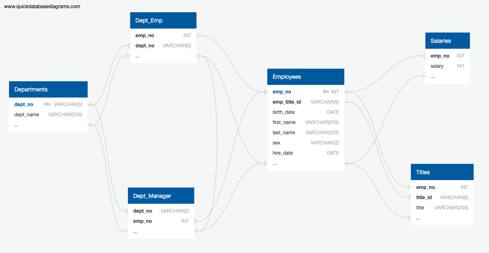
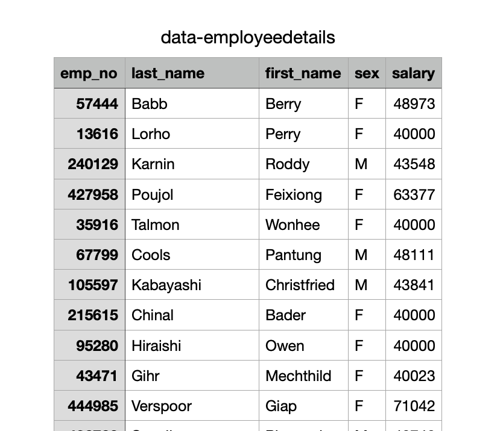
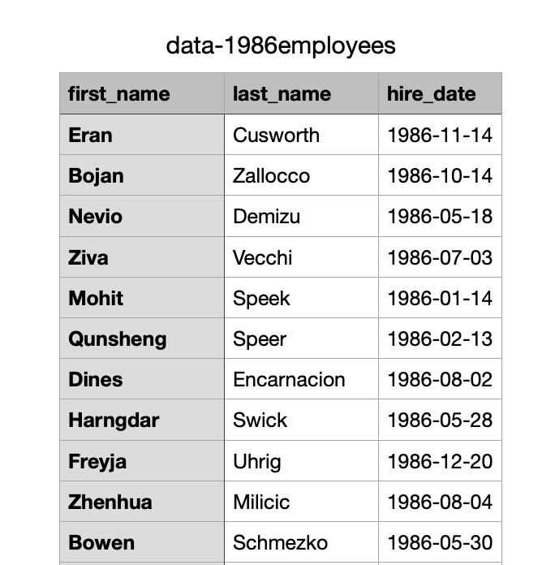
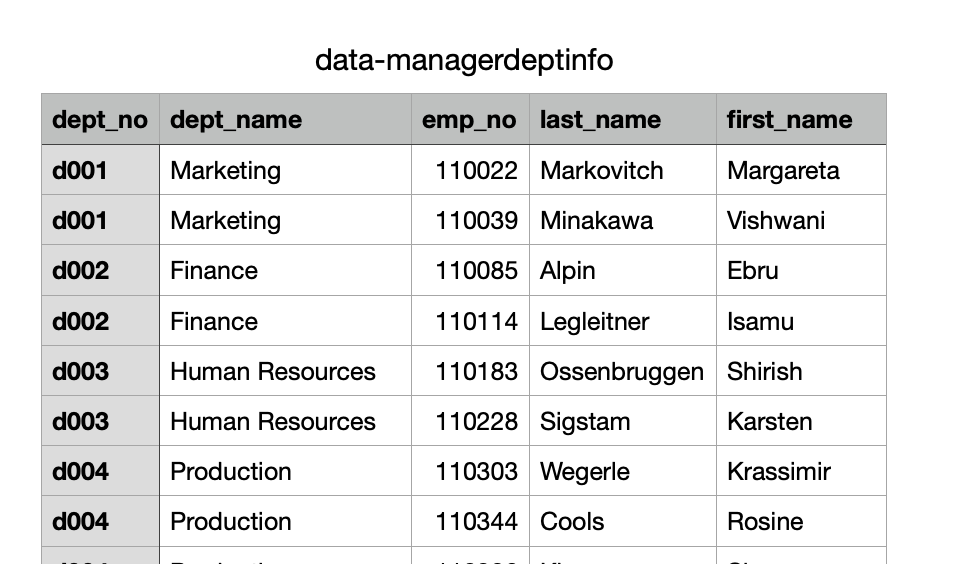
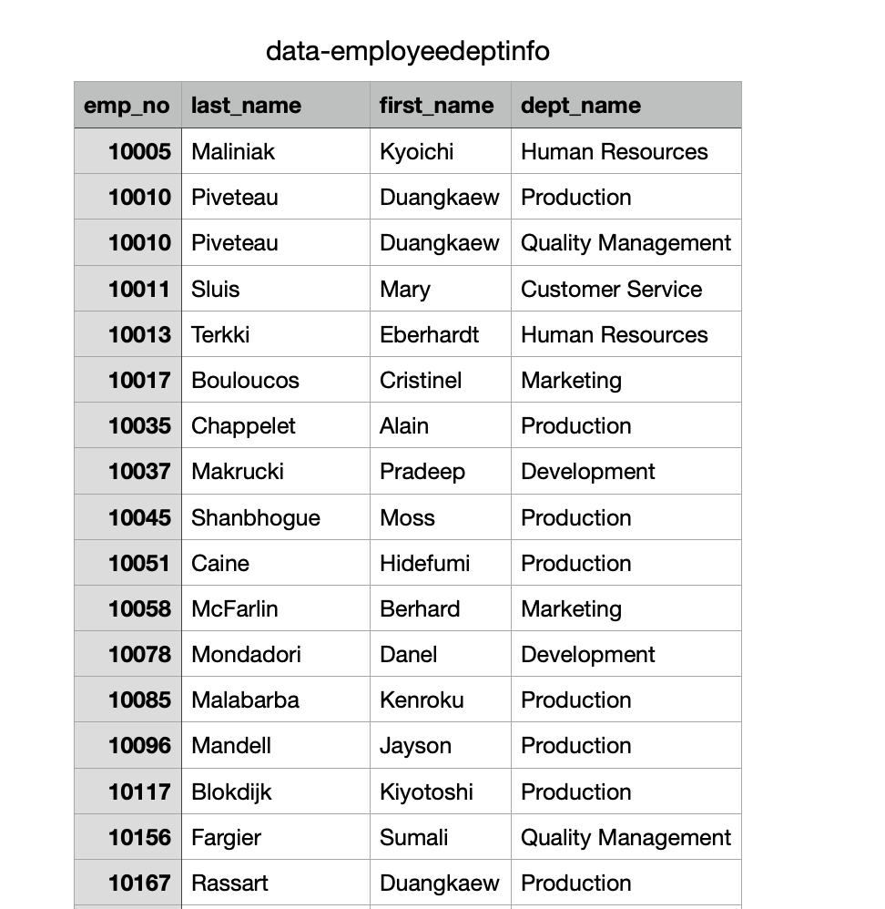
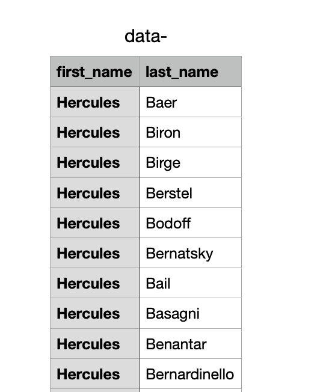
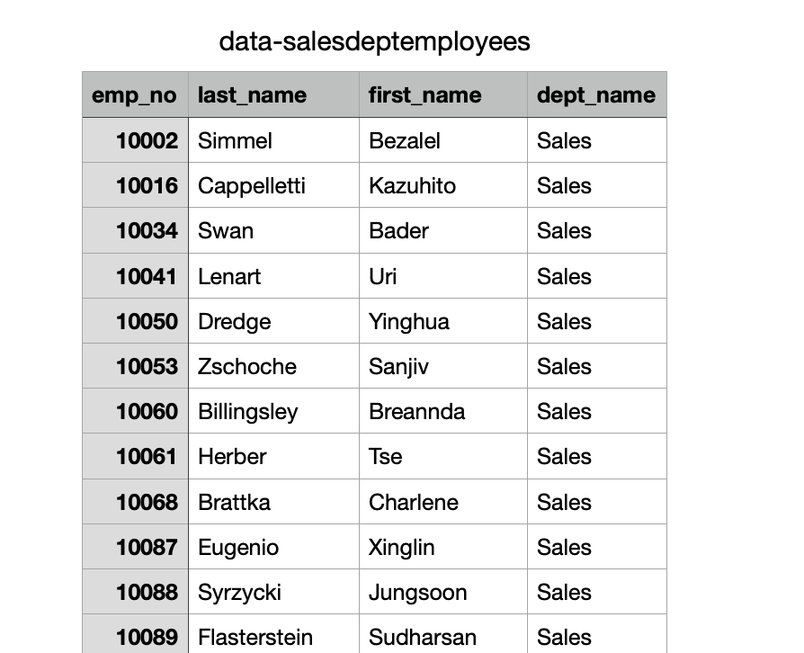
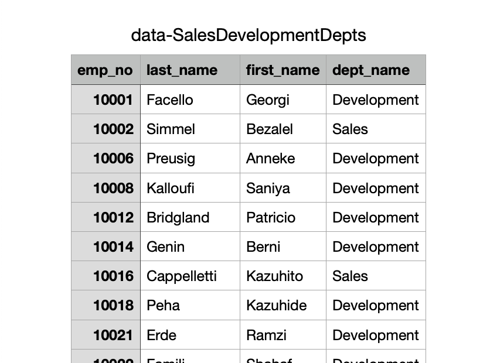
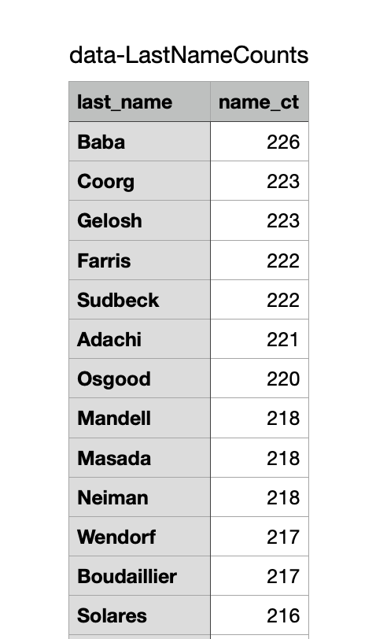

## Employee SQL Homework

The goal of the SQL homework was to analyze employee information through several CSV files using the SQL program.

##Process
The intial part of my process involved creating an ERD using the new software program shown in class called QuickDBD. This allowed me to view the
relationships between each of the CSV files.

The next step was to create my schema.sql which created the requested tables and allowed me to import each of the CSV files. 

The last step was to create my query.sql to answer the eight questions posed.

1.List the following details of each employee: employee number, last name, first name, sex, and salary.

2.List first name, last name, and hire date for employees who were hired in 1986.

3.List the manager of each department with the following information: department number, department name, the manager's employee number, last name, first name.

4.List the department of each employee with the following information: employee number, last name, first name, and department name.

5.List first name, last name, and sex for employees whose first name is "Hercules" and last names begin with "B."

6.List all employees in the Sales department, including their employee number, last name, first name, and department name.

7.List all employees in the Sales and Development departments, including their employee number, last name, first name, and department name.

8.In descending order, list the frequency count of employee last names, i.e., how many employees share each last name.

